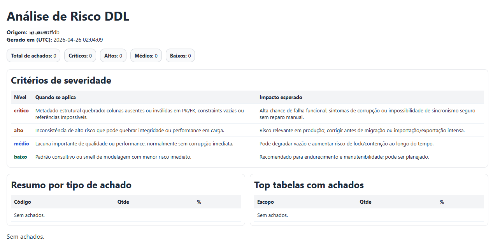
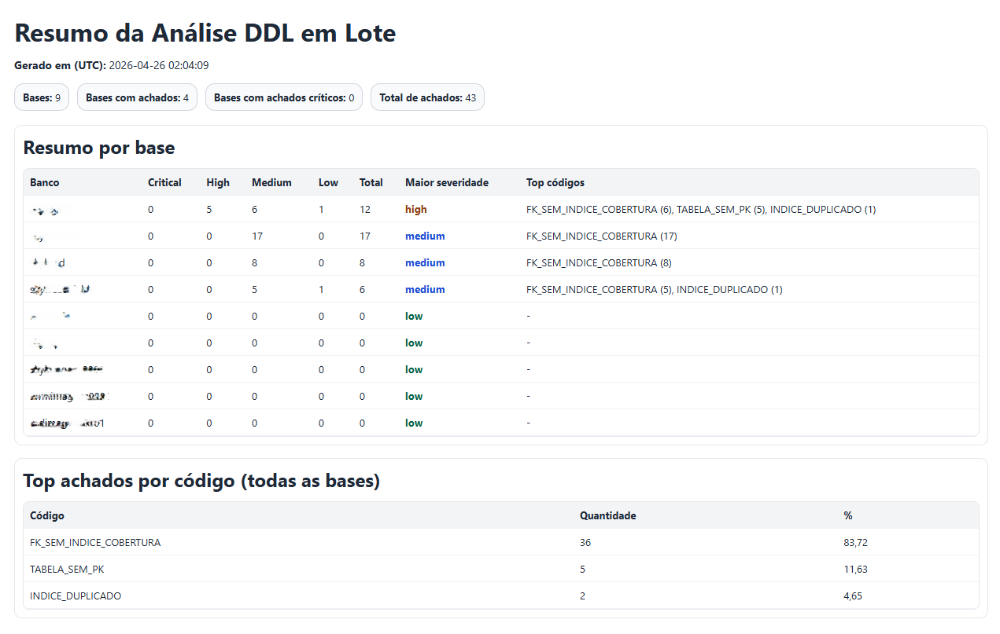

# `ddl-analyze` command

## What it does
Analyzes schema structural risk and generates:
- analysis JSON (`.json`)
- HTML report (`.html`)
- batch consolidated summary (`batch_analysis_summary_*.json/.html`) in batch mode

When used with `--database`, it also runs operational checks from Firebird monitoring tables (`MON$`) and adds findings to the same report.

It also detects index redundancy by prefix (for example, `(A)` potentially redundant when `(A,B)` already exists with same direction).

## How to use
```powershell
SkyFBTool ddl-analyze --input INPUT --output PREFIX [options]
SkyFBTool ddl-analyze --database PATH.fdb --output PREFIX [options]
SkyFBTool ddl-analyze --databases-batch "C:\data\*.fdb" --output DIRECTORY [options]
```

## All options
- `--input`: file input (`.schema.json` or `.sql`).
- `--source`: alias for `--input`.
- `--database`: single database input.
- `--databases-batch`: wildcard for batch input (`*`, `?`).
- `--host`: server host (default: `localhost`).
- `--port`: server port (default: `3050`).
- `--user`: user (default: `sysdba`).
- `--password`: password (default: `masterkey`).
- `--charset`: optional connection charset.
- `--output`: output prefix/file base/directory.
- `--ignore-table-prefix`: ignore table prefix (repeatable).
- `--ignore-table-prefixes`: comma-separated ignore prefixes.
- `--severity-config`: severity override JSON.

## Rules
- Use only one input mode: file (`--input/--source`) or single DB (`--database`) or batch (`--databases-batch`).
- `--database` does not accept wildcard; wildcard mode is `--databases-batch`.
- Operational checks are available only in DB mode (`--database`), not in file mode (`--input/--source`).

## Examples
```powershell
SkyFBTool ddl-analyze --input "C:\ddl\source.schema.json" --output "C:\ddl\analysis"
SkyFBTool ddl-analyze --database "C:\data\source.fdb" --output "C:\ddl\analysis_from_db"
SkyFBTool ddl-analyze --databases-batch "C:\data\*.fdb" --output "C:\ddl\analysis_batch\"
SkyFBTool ddl-analyze --input "C:\ddl\source.sql" --ignore-table-prefix LOG_ --ignore-table-prefixes TMP_,IBE$ --severity-config ".\docs\examples\ddl-severity.sample.json" --output "C:\ddl\analysis_custom"
```

## Report example


## Batch summary example

